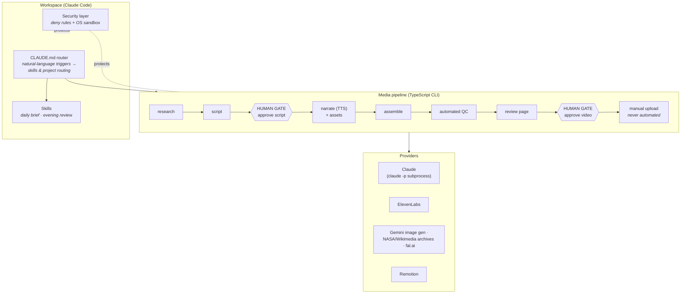

# claude-automation

**A real, daily-driven automation layer built on Claude Code — agentic pipelines with human gates, a security model, and conventions that keep it maintainable.**

This repo documents a system I run every day: a personal workspace where Claude Code acts as an orchestration layer across several production pipelines — most prominently an **AI content production pipeline** that turns research into publishable long-form video, with hard human approval gates at every irreversible step.

> **Used in production for a real YouTube content workflow** (calm, long-form documentary/sleep content). The videos are the output; the system around them is the point.

## Why this exists

Most "AI automation" demos are a prompt and a loop. The interesting problems show up when an agentic system runs *for real, every day*:

- How do you stop an agent **before** the irreversible step (spending money, publishing, sending)?
- How do you keep API keys and personal data **provably out of the model's reach**?
- How do you hand over context between sessions **without re-sending your whole history**?
- How do you make multi-stage pipelines **resumable, auditable, and honest** about what's AI-generated?

This repo is my working answers, extracted from the actual system and sanitized for publication.

## Architecture at a glance

**Key property of every tool in this workspace: it stops before the irreversible step.** No auto-publish, no auto-send, no auto-submit, no mass operations. Steps that cost money or touch the outside world sit behind explicit approval gates enforced in code — not in prompts.

## What's documented here

| Doc | What it covers |
|---|---|
| [01 — The assistant layer](docs/01-assistant-layer.md) | A `CLAUDE.md` router with natural-language triggers, daily skills, and cross-project briefs built from per-project handover files |
| [02 — The media pipeline](docs/02-media-pipeline.md) | The main case: a multi-stage content pipeline with centrally enforced approval gates, a rights invariant, automated QC, and multi-channel config |
| [03 — Safety & security](docs/03-safety-and-security.md) | Two-layer secret protection (permission deny rules + OS sandbox), the secrets convention, key rotation, and "guarantee by absence" |
| [04 — Conventions](docs/04-conventions.md) | Session handover via `progress.md`, token economics, the anatomy of a good `CLAUDE.md`, and a maturity ladder for automation |

Reusable templates live in [`examples/`](examples/): a [security settings template](examples/settings.security.json), a [generic daily-brief skill](examples/skills/daily-brief/SKILL.md), and a [workspace router template](examples/CLAUDE.md.template).

## Stack

Claude Code (skills, permission rules, OS sandbox, `claude -p` headless as the only LLM entry point) · TypeScript + commander CLIs · zod-validated JSON state · ElevenLabs TTS with word timestamps · Remotion rendering · Gemini image generation · NASA & Wikimedia archival sources · fal.ai video generation.

Notably absent from the dependencies: any LLM SDK. All model calls go through a provider interface that shells out to `claude -p`, so the pipelines ride on an existing subscription, stay vendor-swappable, and never handle an API key for the LLM at all.

## Honesty notes

- Everything described here **runs today**; nothing is aspirational. Where a pattern is planned but not built, the docs say so.
- AI-generated imagery in the pipeline output is **labeled as AI-generated** in the published metadata — it is never presented as authentic archival material.
- This repo is a sanitized extraction: personal data, business figures, and channel identities are deliberately left out.

## License

[MIT](LICENSE) — take the patterns, adapt the templates.
